<!-- ============================================================================== -->
<!-- 🎬 ANIMATED CONTRIBUTION GLINT BAR (GOLD & EMERALD INDUSTRIAL REACTOR THEME) -->
<!-- ============================================================================== -->
<p align="center">
  
</p>

<!-- ============================================================================== -->
<!-- 🖥️ TERMINAL CARD & NEOFETCH INFO CARD (SIDE-BY-SIDE INTERACTIVE BLUEPRINT)     -->
<!-- ============================================================================== -->
<table width="100%" border="0" align="center">
  <tr>
    <td width="48%" valign="middle" align="center" style="border: none; background: none;">
      
    </td>
    <td width="52%" valign="top" align="center" style="border: none; background: none;">
      
    </td>
  </tr>
</table>

<!-- ============================================================================== -->
<!-- 🏆 DYNAMIC CAPSULE HERO & TYPING BANNER                                       -->
<!-- ============================================================================== -->
<div align="center">
  

  <a href="https://github.com/Virus1260">
    
  </a>

  <p>
    <a href="mailto:shekharmishra2003@gmail.com"></a>
    <a href="https://www.linkedin.com/in/virus1260"></a>
    <a href="https://virus1260.vercel.app"></a>
    <a href="https://grabcad.com/shekhar.mishra-2"></a>
    
  </p>

  <p>
    
  </p>
</div>

<br/>

<!-- ============================================================================== -->
<!-- ⚡ QUANTIFIED IMPACT METRICS (THE HEAVY ENGINEERING BENCHMARK)                -->
<!-- ============================================================================== -->
<div align="center">
  <h2>⚡ Verified Engineering Scale & Quantified Impact</h2>
</div>

<table width="100%" align="center">
  <tr>
    <td width="33%" align="center" valign="top">
      <h3>🏗️ 16,930 TONS</h3>
      <p><b>Max Equipment Scale</b><br/>High-tonnage Reactor & Regenerator packages engineered for Kuwait National Petroleum Company (KNPC).</p>
    </td>
    <td width="33%" align="center" valign="top">
      <h3>❄️ 🔥 −212°C → +1200°C</h3>
      <p><b>Thermal Envelope</b><br/>Cryogenic static equipment to extreme-temperature refractory-lined reactors across exotic metallurgy.</p>
    </td>
    <td width="34%" align="center" valign="top">
      <h3>🚀 70% – 85%</h3>
      <p><b>Automation Man-Hour Cut</b><br/>In-house Python/AutoCAD surface-development automation tool cutting drafting from 32h to 4h.</p>
    </td>
  </tr>
  <tr>
    <td width="33%" align="center" valign="top">
      <h3>🛡️ 0 NCRs</h3>
      <p><b>Quality Record</b><br/>Closed critical international client reviews with zero Non-Conformance Reports (Saudi Aramco, KNPC, ExxonMobil).</p>
    </td>
    <td width="33%" align="center" valign="top">
      <h3>🏭 1,150 KTPA</h3>
      <p><b>Swing Unit Leadership</b><br/>Leading static equipment engineering for BPCL Bina Petrochemical Project (2 × 575 KTPA LLDPE/HDPE trains).</p>
    </td>
    <td width="34%" align="center" valign="top">
      <h3>🎓 8.97 CGPA</h3>
      <p><b>Academic Distinction</b><br/>B.Tech Mechanical Engineering (RTMNU) • Diploma 90.15% • CAD Master ANSYS Certified Specialist.</p>
    </td>
  </tr>
</table>

---

<!-- ============================================================================== -->
<!-- 🚀 ABOUT & ENGINEERING PHILOSOPHY                                             -->
<!-- ============================================================================== -->
<h2 align="center">🚀 Engineering Philosophy & Profile</h2>

<table width="100%" border="0">
<tr>
<td width="58%" valign="top" style="border: none; background: none;">

### 👨‍🔧 Who am I?

* 🏆 **Senior Mechanical Design Engineer** specializing in ASME BPVC Sec. VIII Div. 1 & 2 / PED-compliant static equipment — pressure vessels, reactors, heat exchangers, and heavy distillation columns.
* 💻 **Engineering Automation Architect & Hobbyist Coder** building custom Python algorithms, CAD API automations, and interactive web tools that eliminate repetitive engineering toil.
* 🏭 Currently **leading engineering execution** at **Grand Prix Engineering (P) Ltd.** for the world-scale BPCL Bina Refinery Petrochemical Project (1,150 KTPA LLDPE/HDPE Swing Unit) and IOCL 10 KTPA Green Hydrogen Plant (Panipat).
* 🏢 Ex-**L&T Heavy Engineering** • Directed high-tonnage KNPC Reactor/Regenerator packages, ExxonMobil Coker Scrubber towers, and Aramco filter packages with zero NCRs.
* 🧪 Expert across exotic alloys: **Carbon Steel, Cr-Mo Low Alloy, Super Duplex, Hastelloy, Cupro-Nickel, and Titanium**.

<blockquote>
  <p align="left">
    <i>"Every kilogram of steel under pressure is a calculation of safety, thermodynamics, and integrity. Every calculation automated is precision multiplied infinitely."</i>
  </p>
</blockquote>

</td>
<td width="42%" align="center" valign="middle" style="border: none; background: none;">

```
        ╔═══════════════════════════════════════╗
        ║    STATIC EQUIPMENT DESIGN MATRIX     ║
        ╠═══════════════════════════════════════╣
        ║  [•] Pressure Vessels  (ASME Sec VIII)║
        ║  [•] Heavy Reactors    (Up to 16,930T)║
        ║  [•] Heat Exchangers   (TEMA / API660)║
        ║  [•] Scrubber Towers   (FEA Re-Design)║
        ║  [•] Surface Dev (AutoCAD/Python API) ║
        ║  [•] CFD & FEA         (ANSYS Master) ║
        ║  [•] Clean H2 Systems  (Panipat 10K)  ║
        ╚═══════════════════════════════════════╝
```

<a href="https://virus1260.vercel.app">
  
</a>

</td>
</tr>
</table>

---

<!-- ============================================================================== -->
<!-- ⚡ DUAL ENGINEERING ARSENAL (HEAVY MECHANICAL + SOFTWARE AUTOMATION)           -->
<!-- ============================================================================== -->
<h2 align="center">⚡ Dual Engineering Arsenal</h2>
<p align="center"><i>Merging heavy industrial mechanical integrity with full-stack automation engineering.</i></p>

<table width="100%" align="center">
  <tr>
    <td width="50%" valign="top">
      <h3>🏛️ Design Codes & International Standards</h3>
      <p>
        
        
        
        
      </p>
      <p>EN 13445 • EJMA • IOGP • PIP • OISD • ASTM • ANSI • IBR • ISO • BS • BIS</p>
      <br/>

      <h3>🔬 FEA / CFD & Advanced Simulation</h3>
      <p>
        
        
        
      </p>
      <p>Lifting & Tail Analysis • Transportation FEA • Nozzle Local Loads • Deflection Evaluation • Computational Fluid Dynamics (8,000 RPM Emulsion Modeling)</p>
      <br/>

      <h3>📐 3D CAD & Mechanical Sizing</h3>
      <p>
        
        
        
        
        
      </p>
    </td>
    <td width="50%" valign="top">
      <h3>💻 Software & Automation Languages</h3>
      <br/><br/>

      <h3>🌐 Frontend & 3D Web Stack</h3>
      <br/><br/>

      <h3>⚙️ Backend, Systems & Tools</h3>
      <br/><br/>

      <h3>🧪 Exotic Metallurgy & Materials of Construction</h3>
      <p>
        
        
        
        
        
        
      </p>
      <br/>

      <h3>📋 Engineering Execution & QA Delivery</h3>
      <p>Technical Bid Evaluations (TBEs) • Vendor Drawing Reviews • Technical Delivery Conditions (TDCs/ARMs) • Technical Query (TQ) Resolution • PMG/Shop-Floor Coordination • GET/Junior Engineer Mentoring</p>
    </td>
  </tr>
</table>

---

<!-- ============================================================================== -->
<!-- 💼 FEATURED FLAGSHIP ENGINEERING PROJECTS                                     -->
<!-- ============================================================================== -->
<h2 align="center">💼 Flagship Industrial & Automation Milestones</h2>

<table width="100%">
  <tr>
    <td width="50%" valign="top">
      <h3>🏭 1,150 KTPA LLDPE/HDPE Petrochemical Swing Unit</h3>
      <p><b>Client:</b> Bharat Petroleum Corporation Limited (BPCL Bina Refinery)<br/>
      <b>EPC:</b> L&T Energy Hydrocarbon | <b>Current Role:</b> Lead Engineering — Grand Prix</p>
      <p>Leading the complete engineering package for a 1,150 KTPA polyolefin swing facility (2 × 575 KTPA trains). Owning team deliverables, task allocation, technical coordination, vendor reviews, and execution schedules.</p>
      <p>
        <code>BPCL</code> <code>Petrochemical</code> <code>LLDPE/HDPE</code> <code>ASME Sec. VIII</code> <code>Lead Engineer</code>
      </p>
      <ul>
        <li>✔ World-scale 2-train swing production unit</li>
        <li>✔ Full design review & client technical coordination</li>
      </ul>
    </td>
    <td width="50%" valign="top">
      <h3>🔥 16,930-Ton KNPC Reactor & Regenerator Packages</h3>
      <p><b>Client:</b> Kuwait National Petroleum Company (KNPC)<br/>
      <b>Collaborators:</b> Wood · Shell | <b>Role:</b> Sr. Static Design Engineer — L&T</p>
      <p>Led full mechanical design cycles for high-tonnage Reactor & Regenerator (RR) packages ranging from 180 to 16,930 Tons, operating at 620°C to 1230°C to ASME Sec. VIII Div. 1 and Shell/Wood client specifications.</p>
      <p>
        <code>KNPC</code> <code>Wood</code> <code>Shell</code> <code>16,930 Tons</code> <code>620–1230°C</code> <code>ASME VIII</code>
      </p>
      <ul>
        <li>✔ High-temperature refractory & exotic alloy vessel design</li>
        <li>✔ Comprehensive FEA lifting & deflection compliance</li>
      </ul>
    </td>
  </tr>
  <tr>
    <td width="50%" valign="top">
      <h3>⚡ In-House Python/AutoCAD Surface-Development Engine</h3>
      <p><b>Initiative:</b> Digitalisation & Workflow Automation<br/>
      <b>Role:</b> Lead Developer — L&T Heavy Engineering</p>
      <p>Engineered an in-house Python + AutoCAD automation system that calculates planar surface development for pressure vessel shells and nozzles, slashing engineering preparation from ~24–32 hours to ~4–8 hours per equipment (70–85% man-hour savings).</p>
      <p>
        <code>Python</code> <code>AutoCAD API</code> <code>70–85% Saved</code> <code>In-House IP</code> <code>CAD Automation</code>
      </p>
      <ul>
        <li>✔ Automated 2D pattern unrolling & nozzle intersection curves</li>
        <li>✔ Deployed across active shop-floor fabrication packages</li>
      </ul>
    </td>
    <td width="50%" valign="top">
      <h3>🗼 ExxonMobil Sarnia Coker Scrubber Tower (~250T)</h3>
      <p><b>Client:</b> ExxonMobil — Sarnia Refinery, Canada<br/>
      <b>Role:</b> Sr. Static Design Engineer — L&T Heavy Engineering</p>
      <p>Engineered the replacement design of a ~250-Ton Coker Scrubber Tower and partial reactor replacement. Conducted FEA-validated redesign of legacy equipment, nozzle load reconciliation, and structural deflection checks.</p>
      <p>
        <code>ExxonMobil</code> <code>Canada</code> <code>250 Tons</code> <code>Coker Scrubber</code> <code>FEA Redesign</code>
      </p>
      <ul>
        <li>✔ Legacy brownfield retrofit with strict nozzle allowable limits</li>
        <li>✔ Transport & heavy-lift rigging FEA validation</li>
      </ul>
    </td>
  </tr>
  <tr>
    <td width="50%" valign="top">
      <h3>🛡️ Saudi Aramco & PALL Filter Vessels / KO Drums</h3>
      <p><b>Client:</b> Saudi Aramco · PALL Corporation<br/>
      <b>EPC:</b> L&T Hydrocarbon | <b>Role:</b> Sr. Static Design Engineer — L&T</p>
      <p>Directed detailed mechanical design of critical Filter Vessels and Knock-Out Drums under rigorous Aramco standards. Successfully closed full client review cycle with <b>zero Non-Conformance Reports (0 NCRs)</b>.</p>
      <p>
        <code>Saudi Aramco</code> <code>PALL</code> <code>Zero NCRs</code> <code>Filter Vessels</code> <code>KO Drums</code>
      </p>
      <ul>
        <li>✔ Flawless client review with 0 NCRs</li>
        <li>✔ Strict compliance with Saudi Aramco engineering standards</li>
      </ul>
    </td>
    <td width="50%" valign="top">
      <h3>🌱 IOCL 10 KTPA Green Hydrogen Plant (Panipat)</h3>
      <p><b>Client:</b> Indian Oil Corporation Limited (IOCL)<br/>
      <b>EPC:</b> L&T Energy GreenTech | <b>Role:</b> Lead Engineering — Grand Prix</p>
      <p>Led static equipment engineering deliverables for India's milestone green hydrogen generation project. Coordinated technical requisitions, datasheets, and equipment specifications for hydrogen service.</p>
      <p>
        <code>Green Hydrogen</code> <code>IOCL</code> <code>Clean Energy</code> <code>L&T GreenTech</code> <code>H2 Service</code>
      </p>
      <ul>
        <li>✔ Clean hydrogen generation plant infrastructure</li>
        <li>✔ Specialized hydrogen embrittlement metallurgy compliance</li>
      </ul>
    </td>
  </tr>
</table>

---

<!-- ============================================================================== -->
<!-- 🗺️ CAREER ROUTE & PROFESSIONAL TRAJECTORY                                    -->
<!-- ============================================================================== -->
<h2 align="center">🗺️ Career Route & Chronological Trajectory</h2>

```
╔═══════════════════════════════════════════════════════════════════════════════════════════╗
║  GRAND PRIX ENGINEERING (P) LTD.                                      JUN 2026 – PRESENT  ║
║  Sr. Engineer – Engineering                                                               ║
║  • Leading engineering for BPCL Bina 1,150 KTPA LLDPE/HDPE Petrochemical Swing Unit       ║
║  • Led engineering for IOCL 10 KTPA Green Hydrogen Plant, Panipat (L&T GreenTech)         ║
╠═══════════════════════════════════════════════════════════════════════════════════════════╣
║  L&T HEAVY ENGINEERING                                                MAR 2025 – JUN 2026  ║
║  Sr. Static Design Engineer – RPV                                                         ║
║  • Developed Python/AutoCAD surface-development tool (70–85% man-hour savings)            ║
║  • Led KNPC high-tonnage Reactor & Regenerator packages (180–16,930 Tons, 620–1230°C)     ║
║  • Directed ExxonMobil Sarnia ~250T Coker Scrubber & Aramco/PALL Filter Vessels (0 NCRs)  ║
╠═══════════════════════════════════════════════════════════════════════════════════════════╣
║  KINAM ENGINEERING INDUSTRIES PVT. LTD.                               JAN 2025 – MAR 2025  ║
║  Static Design Engineer                                                                   ║
║  • Designed Shell & Tube, Spiral, Box, Helical & Air Coolers per ASME VIII & TEMA         ║
║  • Led 8-unit Shell & Tube Exchanger package (~90 Tons) for Haldia Petrochemicals         ║
╠═══════════════════════════════════════════════════════════════════════════════════════════╣
║  GEECY ENGINEERING PVT. LTD.                                          JUN 2024 – JAN 2025  ║
║  Jr. Static Design Engineer – Mechanical                                                  ║
║  • Designed static equipment for blue/green energy: wash coolers, strippers, reactors      ║
║  • Delivered TEMA exchangers (AES, BKM, BKU, NHN) for Reliance, Air Products & Technip    ║
╠═══════════════════════════════════════════════════════════════════════════════════════════╣
║  GEECY ENGINEERING PVT. LTD.                                          JAN 2024 – APR 2024  ║
║  Trainee Intern – Static Design                                                           ║
║  • Analyzed datasheets, PV Elite models, FEA reports with 12-member production crew       ║
╚═══════════════════════════════════════════════════════════════════════════════════════════╝
```

---

<!-- ============================================================================== -->
<!-- 🎓 ACADEMIC HONORS & CERTIFICATIONS                                           -->
<!-- ============================================================================== -->
<h2 align="center">🎓 Academic Honors & Professional Credentials</h2>

<table width="100%" align="center">
  <tr>
    <td width="33%" align="center">
      <h3>🎖️ B.Tech in Mechanical Engineering</h3>
      <p><b>S.B. Jain Institute of Technology, Nagpur</b><br/>
      Rashtrasant Tukadoji Maharaj Nagpur University (RTMNU)<br/>
      <b>CGPA: 8.97 / 10.0</b> • 2021 – 2024</p>
    </td>
    <td width="33%" align="center">
      <h3>📜 Diploma in Mechanical Engineering</h3>
      <p><b>Kamptee Polytechnic</b><br/>
      Maharashtra State Board of Technical Education (MSBTE)<br/>
      <b>Score: 90.15% (Distinction)</b> • 2018 – 2021</p>
    </td>
    <td width="34%" align="center">
      <h3>🔬 ANSYS Master in Product Analysis</h3>
      <p><b>CAD Master Certified</b><br/>
      Advanced Structural FEA & Computational Fluid Dynamics<br/>
      Certified May 2022</p>
    </td>
  </tr>
</table>

---

<!-- ============================================================================== -->
<!-- 📈 LIVE GITHUB ANALYTICS & ACTIVITY                                            -->
<!-- ============================================================================== -->
<h2 align="center">📈 Live GitHub Analytics & Code Activity</h2>

<div align="center">
  <p align="center">
    
    
  </p>

  <p>
    
  </p>

  <p>
    
  </p>
</div>

<!-- ============================================================================== -->
<!-- 🐍 CONTRIBUTION SNAKE GAME (LIVE REPO WORKFLOW GENERATED)                     -->
<!-- ============================================================================== -->
<div align="center">
  <h3>🐍 Code Evolution & Contribution Snake</h3>
  <p><i>The automated snake eats commits on the matrix every 12 hours via GitHub Actions:</i></p>
  <p>
    
  </p>
</div>

---

<!-- ============================================================================== -->
<!-- 🤝 CONNECT & VERIFICATION HUB                                                 -->
<!-- ============================================================================== -->
<div align="center">
  <h2>🤝 Connect with Shekhar Mishra</h2>
  <p><i>Available for global static equipment design consulting, ASME/PED compliance, and CAD automation.</i></p>

  <table align="center">
    <tr>
      <td align="center"><b>📧 Work Email</b></td>
      <td align="center"><a href="mailto:shekharmishra2003@gmail.com">shekharmishra2003@gmail.com</a></td>
    </tr>
    <tr>
      <td align="center"><b>💼 LinkedIn</b></td>
      <td align="center"><a href="https://www.linkedin.com/in/virus1260">linkedin.com/in/virus1260</a></td>
    </tr>
    <tr>
      <td align="center"><b>🌐 3D Portfolio</b></td>
      <td align="center"><a href="https://virus1260.vercel.app">virus1260.vercel.app</a></td>
    </tr>
    <tr>
      <td align="center"><b>🏗️ GrabCAD</b></td>
      <td align="center"><a href="https://grabcad.com/shekhar.mishra-2">grabcad.com/shekhar.mishra-2</a></td>
    </tr>
    <tr>
      <td align="center"><b>📱 Phone</b></td>
      <td align="center"><a href="tel:+919021439341">+91-9021439341</a></td>
    </tr>
    <tr>
      <td align="center"><b>📍 Location</b></td>
      <td align="center">Hazira, Surat, Gujarat — 394270, India</td>
    </tr>
  </table>

  <br/>

  

  <p>
    <sub>Designed with precision industrial aesthetics & elite automation · Engineered by <a href="https://github.com/Virus1260">@Virus1260</a></sub>
  </p>
</div>
